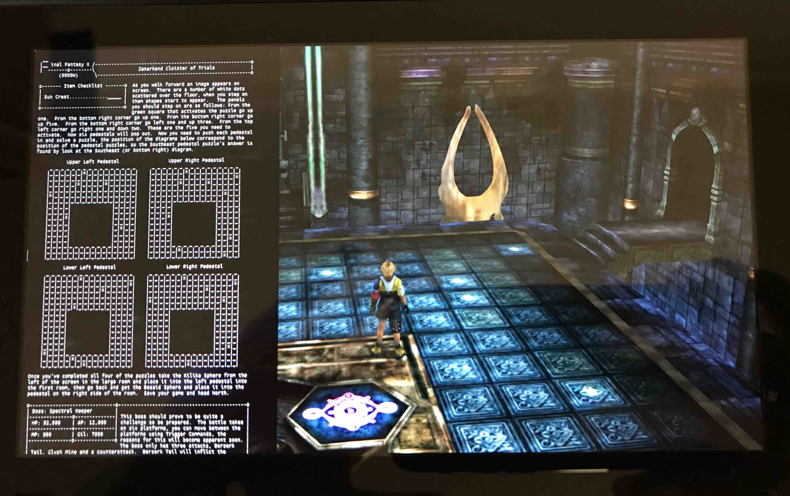

# TextReaderOverlay-NX

TextReaderOverlay is an overlay for the Nintendo Switch that lets you view text files on top of any foreground application. It is launched with [nx-ovlloader](https://github.com/WerWolv/nx-ovlloader) and [Tesla-Menu](https://github.com/WerWolv/Tesla-Menu). [Atmosphere](https://github.com/Atmosphere-NX/Atmosphere) custom firmware is required to run this application.

## Installation

1. Download [nx-ovlloader](https://github.com/WerWolv/nx-ovlloader/releases) and extract it onto your SD card
2. Download [Tesla-Menu](https://github.com/WerWolv/Tesla-Menu/releases) and extract it onto your SD card
3. Download [TextReaderOverlay-NX](https://github.com/diwo/TextReaderOverlay-NX/releases) and extract it onto the root of your SD card
4. Place `*.txt` files anywhere on your SD card
5. Press `L + D-Pad-Down + R-Stick` to launch Tesla-Menu after reboot
6. Select `Text Reader` from the menu

## Screenshot

